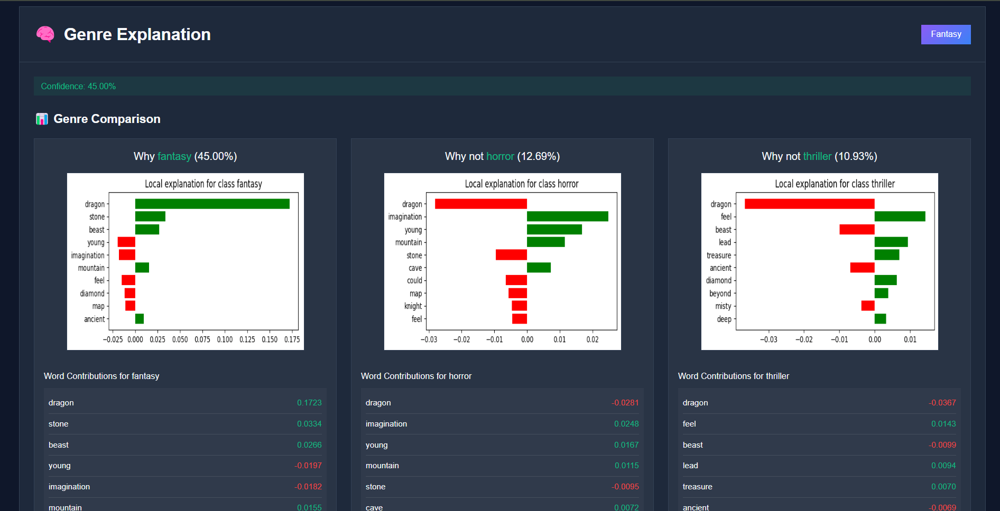

# 🧠 Genre Classifier with LIME Explainability

Welcome to the **Genre Classifier** — an intelligent, interactive machine learning application that predicts the genre of a story or paragraph based on natural language. Powered by an ensemble model and enhanced with LIME explainability, this project transforms short texts into confident predictions and transparent visual explanations.

---

## 🎯 Features

- 🔍 Predicts from 10 popular genres:
  `Crime`, `Fantasy`, `History`, `Horror`, `Psychology`, `Romance`, `Science`, `Sports`, `Thriller`, `Travel`
- 📈 Shows prediction probabilities using an interactive bar chart
- 💡 Includes LIME-based explanations with word-level breakdowns
- 🌐 Simple, standalone HTML frontend — no frameworks required
- ⚙️ Backend powered by Flask + scikit-learn

---

## 🛠 Tech Stack

| Layer          | Tools Used                         |
| -------------- | ---------------------------------- |
| Language       | Python                             |
| Framework      | Flask (API)                        |
| ML Model       | Voting Classifier (LogReg, RF, GB) |
| Vectorizer     | TF-IDF (Unigrams + Bigrams)        |
| Balancing      | SMOTE                              |
| NLP Toolkit    | NLTK                               |
| Explainability | LIME                               |
| Frontend       | HTML + Chart.js                    |

---

## 🚀 Getting Started

To set up and run the app locally:

1. Clone this repository
2. Run the `run.sh` script from your terminal

```bash
# Inside your terminal
bash run.sh
```

---

## 🖼️ Demo Screenshots

Here’s how the app looks in action:

<p align="center">
  
  <br/><em>Genre prediction with probability chart</em>
</p>

<p align="center">
  
  <br/><em>Explainability view powered by LIME</em>
</p>
